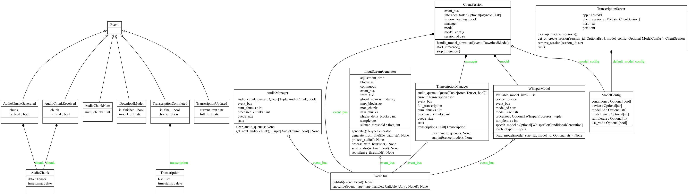
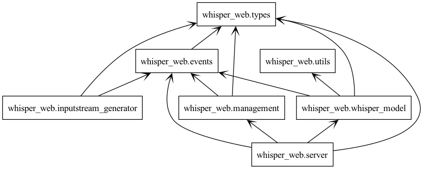

************
Introduction
************

What is Whisper Web?
-------------------

The Whisper Web Transcription Server is a Python-based real-time speech-to-text transcription system powered by
OpenAI's Whisper models. It leverages state-of-the-art models like Distil-Whisper to transcribe audio input
in real-time.

Key Features
^^^^^^^^^^^^

- Real-time Transcription: Transcribes spoken words into text almost instantaneously, making it ideal
  for use cases like live captioning or interactive voice-driven applications.
- Customizable Model Configurations: The system can be fine-tuned with various model configurations
  to accommodate different use cases, such as adjusting the sampling rate, block size, or selecting
  from different Whisper model sizes.
- API Integration: Exposes a RESTful API for easy integration with other services. You can send and
  retrieve transcriptions via HTTP requests, allowing for real-time updates in web or mobile apps.
- Multi-threaded Asynchronous Processing: Leverages asynchronous programming (via asyncio) for optimal
  performance, allowing the transcription engine to handle high volumes of audio input while processing
  transcription results concurrently.
- Memory-Efficient and Scalable: Designed to work efficiently even with resource-intensive models,
  offering scalable transcription performance with lower resource consumption.

Architectural Overview
---------------------

The Whisper Web system follows an event-driven, microservice-oriented architecture that enables
real-time audio processing and transcription. The system is designed with loose coupling between
components, allowing for scalability and maintainability.

System Architecture
^^^^^^^^^^^^^^^^^^

   High-level view of the main components and their interactions

Execution Flow Chart
^^^^^^^^^^^^^^^^^^^^

.. figure:: ../diagrams/whisper_web_flow.png
   :alt: Whisper Web Execution Flow Chart
   :align: center
   :width: 100%

   Detailed execution flow of the transcription process

Pckage Overview
^^^^^^^^^^^^^^^

   Package structure overview showing the main components and their relationships